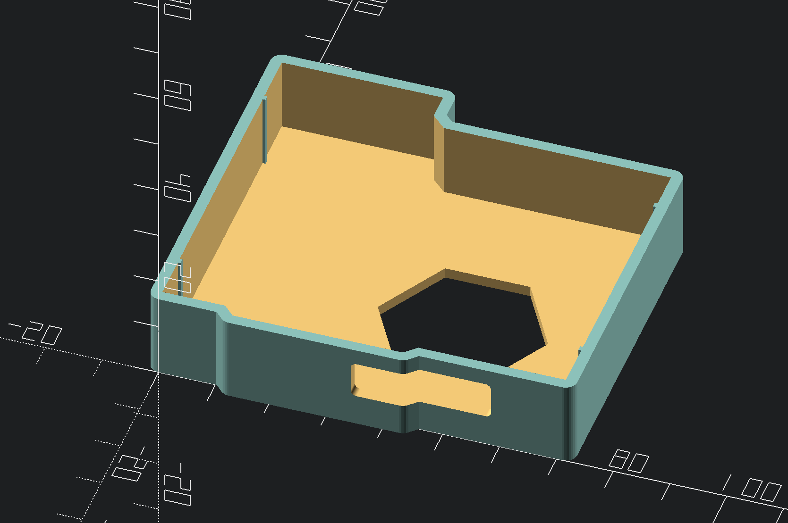

# A 3d printable case for STM P-Nucleo-WB55 board

This repository contains OpenSCAD source files for STM32WB55 Nucleo prototyping board (P-Nucleo-WB55).
I've sketched it quickly so I'm no longer touching it with my ESD generating fingers.

# Download
**Download STL files here:**

[https://www.thingiverse.com/thing:4891735](https://www.thingiverse.com/thing:4891735)

# Preview

**How it looks like:**

